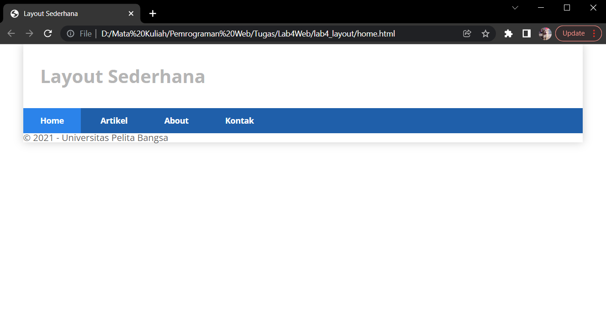

# Latihan Membuat CSS Layout pada website

* Nama          : Hizbullah Ridwan
* NIM           : 312110055
* Kelas         : TI.21.B.1
* Mata Kuliah   : Pemrograman Web

Dalam latihan Membuat CSS Layout ini, saya menggunakan [Google Chrome](https://www.google.com/intl/id_id/chrome/) sebagai web browser dan [visual studio code](https://code.visualstudio.com/) sebagai teks editornya.       

Daftar isi :          
* [Membuat Box Element](https://github.com/Ridwanwildan/Lab4Web#membuat-box-element)         
* [CSS Float Property](https://github.com/Ridwanwildan/Lab4Web#css-float-property)         
* [Mengatur Clearfix Element](https://github.com/Ridwanwildan/Lab4Web#mengatur-clearfix-element)         
* [Membuat Layout Sederhana](https://github.com/Ridwanwildan/Lab4Web#membuat-layout-sederhana)         
* [Membuat Navigasi](https://github.com/Ridwanwildan/Lab4Web#membuat-navigasi)         
* [Mengatur Layout Main dan Sidebar](https://github.com/Ridwanwildan/Lab4Web#mengatur-layout-main-dan-sidebar)         
* [Membuat Sidebar Widget](https://github.com/Ridwanwildan/Lab4Web#membuat-sidebar-widget)         
* [Mengatur Footer](https://github.com/Ridwanwildan/Lab4Web#mengatur-footer)         
* [Menambahkan Content Article](https://github.com/Ridwanwildan/Lab4Web#menambahkan-content-article)         
* [Pertanyaan dan Tugas](https://github.com/Ridwanwildan/Lab4Web#pertanyaan-dan-tugas)         

## Membuat Box Element

Pertama adalah membuat box elementnya terlebih dahulu, tambahkan tag `<section>` kemudian didalamnya         
tambahkan tag `<div>`.                

```bash
<!DOCTYPE html>
<html lang="en">
    <head>
        <meta charset="UTF-8">
        <meta name="viewport" content="width=device-width, initial-scale=1.0">
        <title>Box Element</title>
    </head>
    <body>
        <header>
            <h1>Box Element</h1>
        </header>
        <section>
            <div class="div1">Div 1</div>
            <div class="div2">Div 2</div>
            <div class="div3">Div 3</div>
        </section>
    </body>
</html>
```         

## CSS Float Property

CSS float property ditambahkan didalam CSS. Untuk itu maka harus ditambahkan terlebih dahulu tag CSS nya       
dengan cara tambahkan tag `<style>`. Kemudian didalamnya ditambahkan `float:left` supaya box element div        
berada diposisi sebelah kiri.          

```bash
<style>
div {
    float:left;
    padding: 10px;
}
.div1 {
    background: red;
}
.div2 {
    background: yellow;
}
.div3 {
    background: green;
}
</style>
```         

       

## Mengatur Clearfix Element

Sebelum membuat sebuah clearfix element, tambahkan terlebih dahulu `div` berikutnya dan bisa dibilang sebagai div 4.          
Tambahkan juga classnya yaitu `div4` supaya CSS nya bisa diatur. Tambahkan `clear:left` di CSS.      

```bash
.div4 {
    background-color: blue;
    clear: left;
    float: none;
}
```     

        

## Membuat Layout Sederhana

Selanjutnya adalah membuat layout sederhana. Buat folder baru yang didalamnya sudah diisi file HTML dan CSS.      
Kemudian isi dengan HTML seperti ini :            


```bash
<!DOCTYPE html>
<html lang="en">
    <head>
        <meta charset="UTF-8">
        <meta name="viewport" content="width=device-width, initial-scale=1.0">
        <title>Layout Sederhana</title>
        <link rel="stylesheet" href="style.css">
    </head>
    <body>
        <div id="container">
            <header>
                <h1>Layout Sederhana</h1>
            </header>
            <nav>
                <a href="home.html" class="active">Home</a>
                <a href="artikel.html">Artikel</a>
                <a href="about.html">About</a>
                <a href="kontak.html">Kontak</a>
            </nav>
            <section id="hero"></section>
            <section id="wrapper">
                <section id="main"></section>
                <aside id="sidebar"></aside>
            </section>
            <footer>
                <p>&copy; 2021 - Universitas Pelita Bangsa</p>
            </footer>
        </div>
    </body>
</html>
```        

         

Kemudian tambahkan CSS nya seperti ini :                 

```bash
@import url('https://fonts.googleapis.com/css2?family=Open+Sans:ital,wght@0,300;0,400;0,600;0,700;0,800;1,300;1,400;1,600;1,700;1,800&display=swap');
@import url('https://fonts.googleapis.com/css2?family=Open+Sans+Condensed:ital,wght@0,300;0,700;1,300&display=swap');

* {
 margin: 0;
 padding: 0;
}

body {
 line-height:1;
 font-size:100%;
 font-family:'Open Sans', sans-serif;
 color:#5a5a5a;
}

#container {
 width: 980px;
 margin: 0 auto;
 box-shadow: 0 0 1em #cccccc;
}

/* header */
header {
 padding: 20px;
}

header h1 {
 margin: 20px 10px;
 color: #b5b5b5;
}
```        

         

## Membuat Navigasi

Kemudian tambahkan style pada navigasi dengan CSS seperti ini :               

```bash
/* navigasi */
nav {
    display: block;
    background-color: #1f5faa;
}

nav a {
    padding: 15px 30px;
    display: inline-block;
    color: #ffffff;
    font-size: 14px;
    text-decoration: none;
    font-weight: bold;
}

nav a.active,
nav a:hover {
    background-color: #2b83ea;
}
```        

         

##Membuat Hero

Selanjutnya adalah menambahkan content pada section hero. Tambahkan HTML seperti ini :         

```bash
<section id="hero">
    <h1>Hello World!</h1>
    <p>
        Lorem ipsum dolor sit amet, consectetur adipiscing elit. Vestibulum lorem
        elit, iaculis innisl volutpat, malesuada tincidunt arcu. Proin in leo fringilla,
        vestibulum mi porta, faucibus felis. Integer pharetra est nunc, nec pretium nunc
        pretium ac.
    </p>
    <a href="home.html" class="btn btn-large">Learn more &raquo;</a>
</section>
```        

Tambahkan juga CSS seperti  ini :           

```bash
/* Hero Panel */
#hero {
    background-color: #e4e4e5;
    padding: 50px 20px;
    margin-bottom: 20px;
}

#hero h1 {
    margin-bottom: 20px;
    font-size: 35px;
}

#hero p {
    margin-bottom: 20px;
    font-size: 18px;
    line-height: 25px;
}
```        

         

## Mengatur Layout Main dan Sidebar

Tambahkan CSS seperti ini untuk mengatur layout main dan sidebarnya.             

```bash
/* main content */
#wrapper {
    margin: 0;
}

#main {
    float: left;
    width: 640px;
    padding: 20px;
}

/* sidebar area */
#sidebar {
    float: left;
    width: 260px;
    padding: 20px;
}
```        

## Membuat Sidebar Widget

Tambahkan elemen lain didalam sidebar. Masukkan HTML seperti ini pada tag `<aside>`.           

```bash
<aside id="sidebar">
    <div class="widget-box">
        <h3 class="title">Widget Header</h3>
        <ul>
        <li><a href="#">Widget Link</a></li>
            <li><a href="#">Widget Link</a></li>
            <li><a href="#">Widget Link</a></li>
            <li><a href="#">Widget Link</a></li>
            <li><a href="#">Widget Link</a></li>
        </ul>
    </div>
    <div class="widget-box">
        <h3 class="title">Widget Text</h3>
        <p>
            Vestibulum lorem elit, iaculis in nisl volutpat, malesuada tincidunt
            arcu. Proin in leo fringilla, vestibulum mi porta, faucibus felis. Integer
            pharetra est nunc, nec pretium nunc pretium ac.
        </p>
    </div>
</aside>    
```        

Tambahkan juga CSS nya seperti ini :             

```bash
/* widget */
.widget-box {
    border:1px solid #eee;
    margin-bottom:20px;
}

.widget-box .title {
    padding:10px 16px;
    background-color:#428bca;
    color:#fff;
}

.widget-box ul {
    list-style-type:none;
}

.widget-box li {
    border-bottom:1px solid #eee;
}

.widget-box li a {
 padding:10px 16px;
 color:#333;
 display:block;
 text-decoration:none;
}

.widget-box li:hover a {
 background-color:#eee;
}

.widget-box p {
 padding:15px;
 line-height:25px;
}
```        

         

## Mengatur Footer

Sebelumnya sudah ditambahkan isi dari tag `<footer>`. Sekarang saatnya tambahkan style pada `<footer>`        
dengan menambahkan CSS seperti ini :          

```bash
/* footer */
footer {
    clear:both;
    background-color:#1d1d1d;
    padding:20px;
    color:#eee;
}
```        

         

## Menambahkan Elemen Lainnya pada Main Content

Kemudian isi main content yang sebelumnya sudah dibuat layoutnya. Tambahkan HTML seperti ini :         

```bash
<section id="main">
    <div class="row">
        <div class="box">
            
            <h3>Heading</h3>
            <p>
                Donec sed odio dui. Etiam porta sem malesuada magna mollis
                euismod.
            </p>
            <a href="#" class="btn btn-default">View detail</a>
        </div>
        <div class="box">
            
            <h3>Heading</h3>
            <p>
                Donec sed odio dui. Etiam porta sem malesuada magna mollis
                euismod.
            </p>
            <a href="#" class="btn btn-default">View detail</a>
        </div>
        <div class="box">
            
            <h3>Heading</h3>
            <p>
                Donec sed odio dui. Etiam porta sem malesuada magna mollis
                euismod.
            </p>
            <a href="#" class="btn btn-default">View detail</a>
        </div>
    </div>
</section>
```        

Tambahkan juga CSS nya seperti ini :           

```bash
/* box */
.box {
    display:block;
    float:left;
    width:33.333333%;
    box-sizing:border-box;
    -moz-box-sizing:border-box;
    -webkit-box-sizing:border-box;
    padding:0 10px;
    text-align:center;
}

.box h3 {
    margin: 15px 0;
}

.box p {
    line-height: 20px;
    font-size: 14px;
    margin-bottom: 15px;
}

box img {
    border: 0;
    vertical-align: middle;
}

.image-circle {
    border-radius: 50%;
}

.row {
    margin: 0 -10px;
    box-sizing: border-box;
    -moz-box-sizing: border-box;
    -webkit-box-sizing: border-box;
}

.row:after, .row:before,
.entry:after, .entry:before {
    content:'';
    display:table;
}

.row:after,
.entry:after {
    clear:both;
}
```        

         

## Menambahkan Content Article

Terakhir adalah menambahkan content article pada web. Tambahkan HTML seperti ini :         

```bash
<hr class="divider" />
<article class="entry">
    <h2>First featurette heading.</h2>
    
    <p>
        Lorem ipsum dolor sit amet, consectetur adipiscing elit. Vestibulum lorem
        elit, iaculis in nisl volutpat, malesuada tincidunt arcu. Proin in leo fringilla,
        vestibulum mi porta, faucibus felis. Integer pharetra est nunc, nec pretium nunc
        pretium ac.
    </p>
</article>
<hr class="divider" />
<article class="entry">
    <h2>First featurette heading.</h2>
    
    <p>
        Lorem ipsum dolor sit amet, consectetur adipiscing elit. Vestibulum lorem
        elit, iaculis in nisl volutpat, malesuada tincidunt arcu. Proin in leo fringilla,
        vestibulum mi porta, faucibus felis. Integer pharetra est nunc, nec pretium nunc
        pretium ac.
    </p>
</article>
```        

Tambahkan juga CSS nya seperti ini :         

```bash
.divider {
    border:0;
    border-top:1px solid #eeeeee;
    margin:40px 0;
}

/* entry */
.entry {
    margin: 15px 0;
}

.entry h2 {
    margin-bottom: 20px;
}

.entry p {
 line-height: 25px;
}

.entry img {
 float: left;
 border-radius: 5px;
 margin-right: 15px;
}

.entry .right-img {
 float: right;
}
```        

         

## Pertanyaan dan Tugas

* Tambahkan layout untuk menu about          
    [about.html](https://github.com/Ridwanwildan/Lab4Web/blob/main/lab4_layout/about.html)                

          

* Tambahkan layout untuk menu contact          
    [kontak.html](https://github.com/Ridwanwildan/Lab4Web/blob/main/lab4_layout/kontak.html)                

           